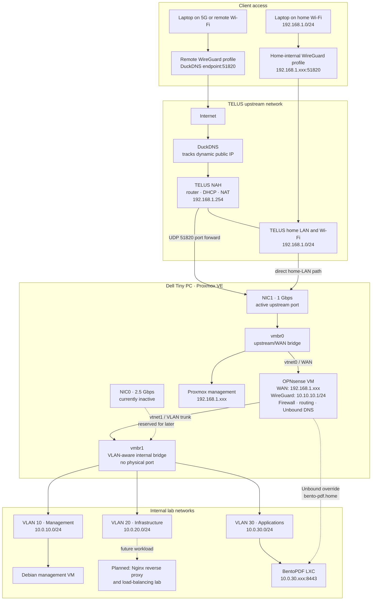

# Network & Topology

This page is the logical architecture reference for the lab. It shows how remote access, the upstream TELUS network, Proxmox virtual networking, OPNsense, and the internal VLANs relate to each other.

!!! note "Diagram scope"
    The diagram records the current logical design. Public hostnames, keys, and other credential-adjacent values are intentionally omitted. Private addresses are included where they make the traffic paths easier to understand.

## Current logical topology



## Access paths

### Remote network

```text
Laptop
  -> remote WireGuard profile
  -> DuckDNS / TELUS public address
  -> TELUS UDP 51820 port forward
  -> OPNsense WireGuard
  -> permitted internal VLAN
```

### Home Wi-Fi

```text
Laptop
  -> home-internal WireGuard profile
  -> OPNsense private WAN address 192.168.1.xxx:51820
  -> OPNsense WireGuard
  -> permitted internal VLAN
```

The separate home profile avoids relying on NAT loopback (hairpin) support in the TELUS router.

### Proxmox management exception

Proxmox management remains at `192.168.1.xxx` on the TELUS LAN for convenient recovery while the lab is still being built. It is reachable directly from trusted home Wi-Fi and is not currently part of the VPN-only internal VLAN design.

## Topology notes

### Proxmox bridges

| Bridge | Purpose |
| --- | --- |
| `vmbr0` | Upstream bridge connected to NIC1; carries Proxmox management and the OPNsense WAN virtual NIC |
| `vmbr1` | VLAN-aware internal bridge; carries the OPNsense LAN trunk and isolated lab guests |

### OPNsense role

OPNsense sits between the external network and the internal lab. It handles:

- routing
- firewall rules
- NAT
- DHCP and Unbound DNS where needed
- WireGuard remote access

### Internal segmentation

The internal side is split by function so the lab stays easier to manage and safer to expand:

| Segment | Purpose |
| --- | --- |
| VLAN 10 — Management | Debian management VM and future administrative services |
| VLAN 20 — Infrastructure | Reserved for shared services and the planned Nginx/reverse-proxy/load-balancing lab |
| VLAN 30 — Applications | BentoPDF and future application workloads |

## Design rules I want to keep

- keep WAN and LAN on different subnets
- add new services to the internal side, not the WAN side
- use VLANs only when they help organization or isolation
- keep remote admin access behind VPN instead of exposing management ports directly
- keep UDP 51820 as the only intentional public inbound port
- treat direct home-LAN Proxmox access as a documented temporary exception

## Related pages

- [IPAM & subnets](ipam.md)
- [Hardware & hosts](hardware.md)
- [OPNsense firewall](../services/opnsense.md)
- [WireGuard VPN](../services/wireguard-vpn.md)
