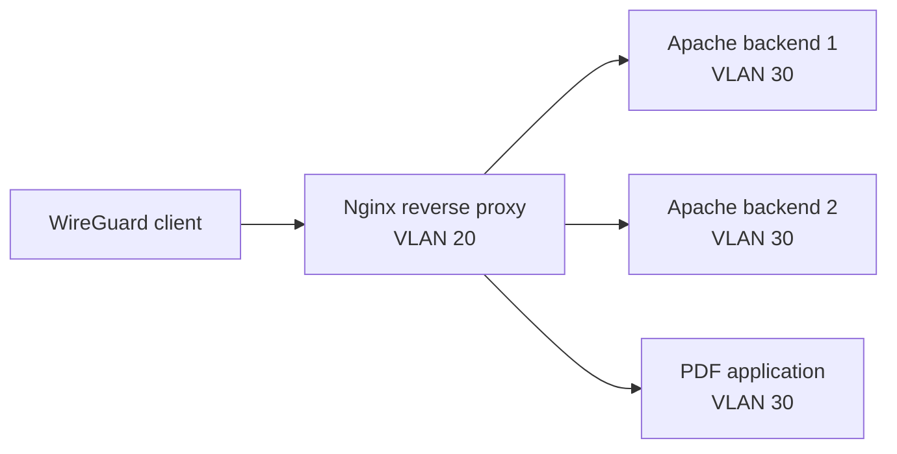

# Nginx Reverse Proxy & Load Balancing

## Status

Planned

## Goal

Use Nginx as a controlled entry point for internal services, then expand the design into multiple Apache backends and basic load balancing.

## What I want to practise

- name-based virtual hosts
- reverse proxy routing
- forwarding headers
- TLS termination with an internal certificate strategy
- access and error logs
- upstream health and failure behavior
- round-robin and weighted load balancing
- firewall policy between proxy and application networks

## Initial shape

The first iteration will place an Nginx proxy in the infrastructure VLAN and application backends in the applications VLAN.

## Intended outcome

Internal applications should be reachable through memorable HTTPS names without exposing their native ports directly to clients. Removing one backend should demonstrate observable failure handling rather than an unexplained outage.

## Questions to answer

- Which headers must the proxy preserve or add?
- Where should TLS terminate?
- How should backend health be measured?
- What should happen when every backend is unavailable?
- Which inter-VLAN flows are actually required?
